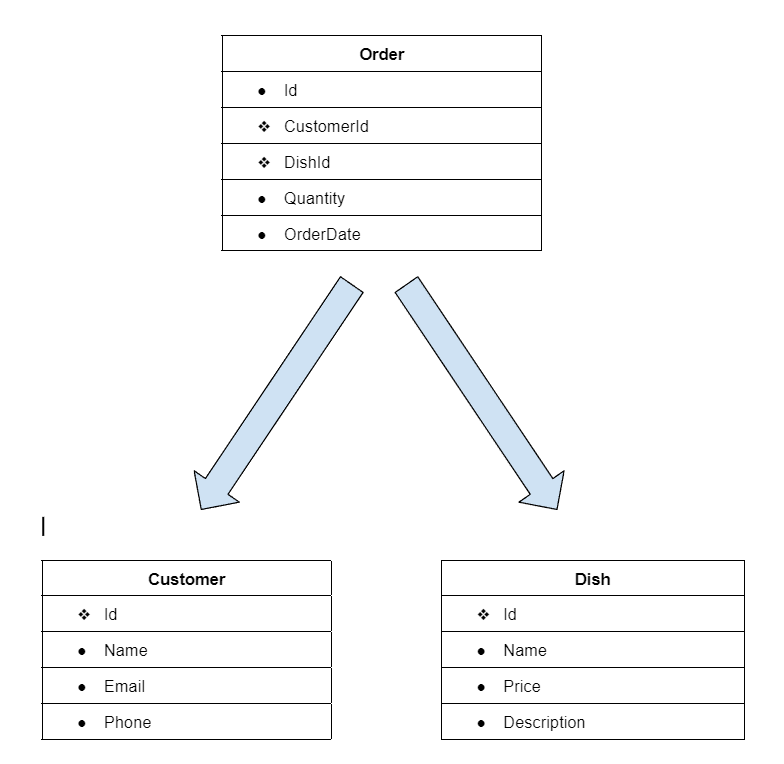

# NaturalLanguage GPT Project

### Restaurant Database Description

My database is supposed to simulate a restaurant database. It has three tables: Customers, Orders, and Dishes. Customers has all the information on each individual customer. Dishes has all the information on each individual dish. Finally Transactions has all the information regarding each individual transaction.

## Schema



## Results

## Queries that worked

Prompt: What is the total revenue generated by all customer orders?

Query:
```sql
SELECT SUM(d.Price * o.Quantity) AS TotalRevenue
FROM `Order` o
JOIN `Dish` d ON o.DishId = d.Id;
```

Response:
```text
[[(71.93)]]
```

## Queries that did not work

prompt: What item is the most successful?

Query:
```sql
SELECT * FROM Dish WHERE Id = 1;
```

Response:
```text
[[(Spaghetti Bolognese)]]
```

Description: Chat-GPT thought did not know how to translate 'most successful' i assumed it would find the most ordered item but it just chose the lowest id.

## Strategies

I originally thought about using the zero-shot strategy because of its versatility but ended up using the single-domain strategy instead becasue it is more accurate and slightly more efficient with my database. I did not consider cross-domain for too long because although it would be great for broader applications my database is simple so it would make things unnecessarily complicated.
